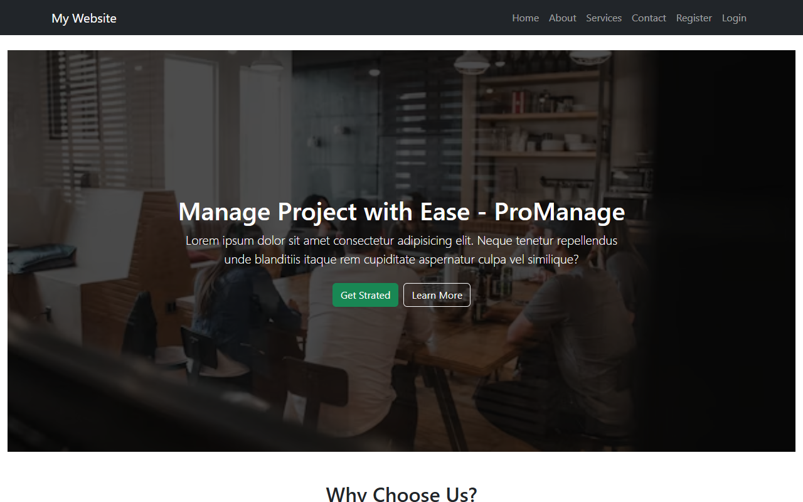
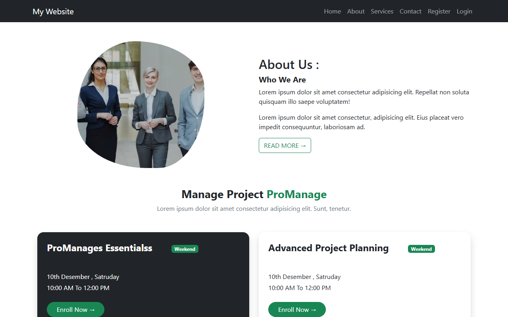
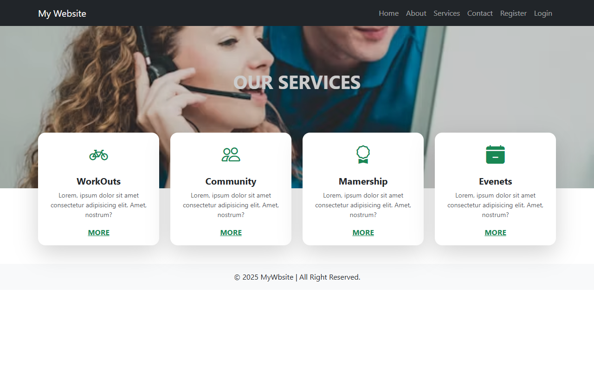
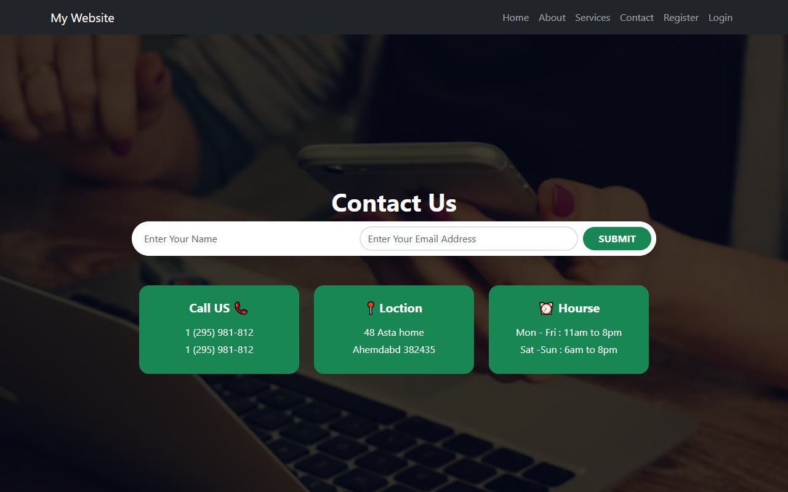
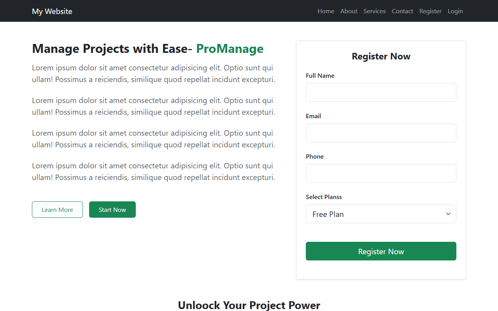
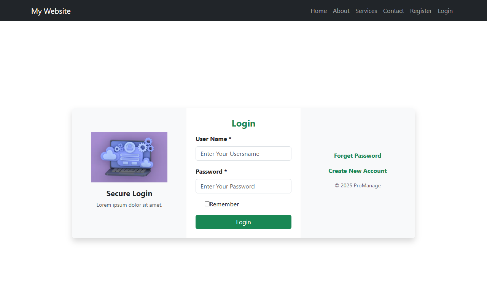

# 🚀 Routing-1 | ProManage - Multi-Page React Website

A modern, responsive multi-page web application built with **React 19**, **React Router DOM v7**, **Bootstrap 5**, and **Vite**. This project demonstrates dynamic client-side routing, modular component architecture, and responsive UI design.

---

## 🌐 Live Demo & Repository

- **Live URL (Vercel):** [Deploy on Vercel](#-vercel-deployment-steps)
- **GitHub Repository:** [https://github.com/mkalsariya9127/Routing-1](https://github.com/mkalsariya9127/Routing-1)

---

## 📸 Output & Preview Screenshots

### 1. 🏠 Home Page


---

### 2. ℹ️ About Us Page


---

### 3. 💼 Services Page


---

### 4. 📞 Contact Page


---

### 5. 📝 Register Page


---

### 6. 🔐 Login Page


---

## ✨ Features

- ⚡ **Fast Performance** powered by Vite 8 and React 19.
- 🧭 **Multi-Page Client-Side Routing** using `react-router-dom` (BrowserRouter, Routes, Route, Link).
- 📱 **Fully Responsive Layout** designed with Bootstrap 5 (Navbar, Cards, Grid, Buttons).
- 🎨 **Modern UI/UX**:
  - Hero section with overlay & call-to-actions
  - Feature & value proposition cards
  - Dedicated team showcase on About page
  - Service grid with icon cards
  - Contact information and inquiry form
  - Form validation on Register and Login pages
- 🔄 **SPA Routing Support** with `vercel.json` rewrite configuration for seamless page reloads on deployment.

---

## 📂 Project Structure

```text
Routing-1/
├── public/                 # Static assets
├── screenshots/            # Output screenshots for documentation
│   ├── home.png
│   ├── about.png
│   ├── services.png
│   ├── contact.png
│   ├── register.png
│   └── login.png
├── src/
│   ├── assets/             # Images and local media
│   ├── components/         # Reusable UI components
│   │   ├── Navbar.jsx      # Navigation bar with router links
│   │   └── Footer.jsx      # Footer component
│   ├── Pages/              # Page views
│   │   ├── Home.jsx        # Landing page
│   │   ├── About.jsx       # About us page
│   │   ├── Services.jsx    # Services listing
│   │   ├── Contact.jsx     # Contact form page
│   │   ├── Register.jsx    # User registration page
│   │   └── Login.jsx       # User login page
│   ├── App.jsx             # Main router configuration
│   ├── index.css           # Global custom styles
│   └── main.jsx            # React root mount
├── index.html              # HTML entry point
├── package.json            # Project dependencies and scripts
├── vercel.json             # Vercel SPA route rewrite configuration
├── vite.config.js          # Vite configuration
└── README.md               # Project documentation
```

---

## 🛠️ Tech Stack

- **Frontend:** [React 19](https://react.dev/)
- **Routing:** [React Router DOM v7](https://reactrouter.com/)
- **Styling:** [Bootstrap 5](https://getbootstrap.com/)
- **Build Tool:** [Vite 8](https://vitejs.dev/)
- **Hosting:** [Vercel](https://vercel.com/)

---

## 💻 Getting Started Locally

### Prerequisites
Make sure you have [Node.js](https://nodejs.org/) installed (v18 or higher recommended).

### 1. Clone the repository
```bash
git clone https://github.com/mkalsariya9127/Routing-1.git
cd Routing-1
```

### 2. Install dependencies
```bash
npm install
```

### 3. Start development server
```bash
npm run dev
```

The application will be running at `http://localhost:5173`.

### 4. Build for production
```bash
npm run build
```

Preview the production build locally:
```bash
npm run preview
```

---

## 🚀 Vercel Deployment Steps

1. Go to [Vercel Dashboard](https://vercel.com/dashboard) and click **Add New Project**.
2. Connect your GitHub account and select the **`Routing-1`** repository.
3. Framework Preset will automatically detect **Vite**.
4. Click **Deploy**.
5. Your website is live!

---

## 👤 Author

- **Milan Kalsariya**
- GitHub: [@mkalsariya9127](https://github.com/mkalsariya9127)
